## 🚀 Como Rodar o Projeto

Este projeto pode ser executado em qualquer sistema operacional (Windows, macOS ou Linux), desde que você tenha os pré-requisitos instalados.

### 📋 Pré-requisitos

Antes de começar, certifique-se de que você tem:

1.  **Java Development Kit (JDK)**: Versão 17 ou superior.
    * Você pode baixar o [OpenJDK aqui](https://jdk.java.net/17/).
2.  **Git** (Opcional, apenas para construir a partir do código-fonte).
    * Você pode [baixar o Git aqui](https://git-scm.com/downloads).

---

### 🔧 Instruções

1.  Abra seu terminal (Prompt de Comando, PowerShell, Terminal, etc.).
2.  Clone o repositório e entre na pasta do projeto:
    ```bash
    git clone [https://github.com/kylorenjr/projeto-poo.git](https://github.com/kylorenjr/projeto-poo.git)
    cd projeto-poo
    ```

3.  Navegue até a pasta de código-fonte `src`:
    ```bash
    cd src
    ```
    *O seu terminal deve estar agora em `.../projeto-poo/src>`*

4.  **Compile** todos os arquivos `.java` de todos os pacotes:
    ```bash
    javac main/*.java enemies/*.java helpers/*.java inputs/*.java managers/*.java objects/*.java scenes/*.java ui/*.java
    ```
    *(Isso diz ao compilador para olhar dentro de cada pasta de pacote e compilar todos os arquivos .java que encontrar)*

5.  **Execute** o projeto chamando a classe `Game` dentro do pacote `main`:
    ```bash
    java main.Game
    ```
## DIAGRAMA DE CLASSES

Aqui está o diagrama de classes do projeto, mostrando as principais entidades e suas relações.

```mermaid
classDiagram
    direction TD

    %% -- Classes "Soltas" (sem relações visíveis no diagrama) --
    class Utilz
    class Tile
    class Game
    class Tower
    class ImgFix
    class PathPoint
    class LoadSave
    class MyButton
    class GameStates
    class GameScreen

    %% -- Classes de UI e Telas (Scenes) --
    class GameScene
    class Constants
    class SceneMethods {
        <<interface>>
    }
    class Playing
    class Editing
    class Settings
    class Menu

    %% -- Relações das Cenas --
    GameScene <|-- Playing
    GameScene <|-- Editing
    GameScene <|-- Settings
    GameScene <|-- Menu
    
    SceneMethods <|.. Playing
    SceneMethods <|.. Editing
    SceneMethods <|.. Settings
    SceneMethods <|.. Menu
    
    GameScene --> Constants

    %% -- Classes de Inimigos (Enemy) --
    class Enemy
    class Orc
    class Bat
    class Wolf
    class Knight

    %% -- Relações dos Inimigos --
    Enemy <|-- Orc
    Enemy <|-- Bat
    Enemy <|-- Wolf
    Enemy <|-- Knight
    
    %% -- Gerenciadores (Managers) --
    class EnemyManager
    class TowerManager
    class TileManager
    class ProjectileManager
    
    EnemyManager --- TowerManager
    ProjectileManager --> Enemy

    %% -- Classes de Input e UI Auxiliar --
    class KeyListener
    class MyMouseListener
    class ToolBar
    class ActionBar
    class Bar

    KeyListener --- TileManager
    MyMouseListener --> ToolBar
    ActionBar --> ToolBar
    Bar --> ActionBar

    %% -- Outras Classes do Jogo --
    class Projectile
    class Render
    
    Projectile --- Render
```


